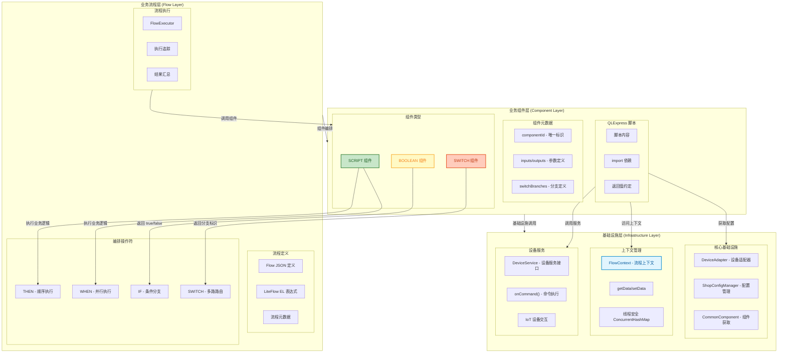
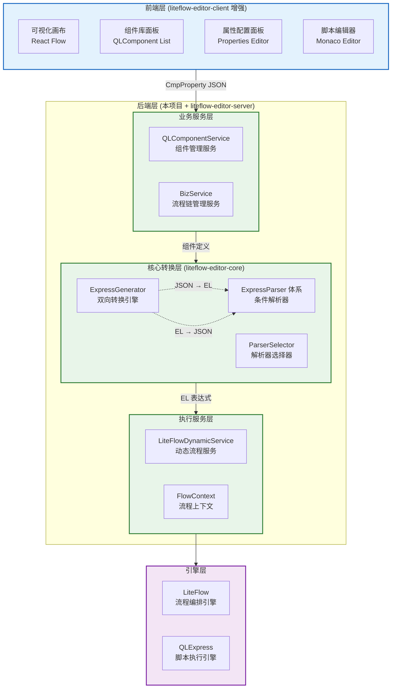

# QLExpress + LiteFlow 组件化编排方案

## 一、方案概述

### 1.1 核心思路

将 **QLExpress** 作为业务逻辑的实现载体（Node），**LiteFlow** 作为流程编排引擎，实现：

- **组件库**：预定义的 QLExpress 脚本组件，每个组件是一个可复用的业务逻辑单元
- **可视化编排**：基于 liteflow-editor-client 增强，支持从组件库拖拽组件进行流程编排
- **智能分支**：Switch 类型组件自动生成对应数量的分支

```
┌──────────────────────────────────────────────────────────────��──────┐
│                         组件设计器 (新增)                             │
│  ┌─────────────────────────────────────────────────────────────┐    │
│  │  组件元数据定义                                               │    │
│  │  - componentId: "checkWatchStatus"                           │    │
│  │  - componentType: BOOLEAN | SCRIPT | SWITCH                  │    │
│  │  - 输入参数: [{name: "deviceAdapter", type: "Object"}]       │    │
│  │  - Switch分支: ["AUTH","DOOR_OPERATE","READ_STATUS"] (SWITCH) │    │
│  │  - QLExpress 脚本编辑器                                       │    │
│  └─────────────────────────────────────────────────────────────┘    │
└─────────────────────────────────────────────────────────────────────┘
                                    ↓ 保存为组件
┌─────────────────────────────────────────────────────────────────────┐
│                     组件库 (Component Library)                       │
│  ┌───────────┐ ┌───────────┐ ┌───────────┐ ┌───────────┐           │
│  │ 值守状态   │ │ 网络检查   │ │ 开门操作   │ │蓝牙命令路由 │ + 添加   │
│  │ BOOLEAN   │ │ BOOLEAN   │ │ SCRIPT    │ │ SWITCH:5  │           │
│  │ out:T/F   │ │ out:T/F   │ │ in:doorNo │ │AUTH/DOOR/ │           │
│  │           │ │           │ │ out:成功   │ │READ/NOTIFY│           │
│  └───────────┘ └───────────┘ └───────────┘ └───────────┘           │
└──────────────────────────────────────────────────────��──────────────┘
                                    ↓ 拖拽组件到编排器
┌─────────────────────────────────────────────────────────────────────┐
│              LiteFlow 编排器 (liteflow-editor-client 增强)           │
│                                                                     │
│  选择 [蓝牙命令路由] 组件后，自动创建 5 个分支：                        │
│                                                                     │
│                           ┌─ AUTH        → [蓝牙认证]     ─┐        │
│                           ├─ DOOR_OPERATE→ [门操作]       ─┤        │
│  [初始化] → [蓝牙命令路由]─┼─ READ_STATUS → [读取门状态]   ─┼→ [响应] │
│                           ├─ NOTIFY      → [通知APP]      ─┤        │
│                           └─ UNKNOWN     → [未知处理]     ─┘        │
│                                                                     │
└─────────────────────────────────────────────────────────────────────┘
```

### 1.2 技术架构

```
┌────────────────────────────────────────────────────────────────┐
│                        前端层                                   │
│  ┌─────────────────┐  ┌─────────────────┐                      │
│  │  组件设计器      │  │  流程编排器      │                      │
│  │  (新增开发)      │  │  (增强现有)      │                      │
│  │                 │  │                 │                      │
│  │ - 脚本编辑      │  │ - 组件拖拽      │                      │
│  │ - 参数配置      │  │ - 流程连线      │                      │
│  │ - 分支定义      │  │ - 智能分支      │                      │
│  └─────────────────┘  └─────────────────┘                      │
└────────────────────────────────────────────────────────────────┘
                              ↓ REST API
┌────────────────────────────────────────────────────────────────┐
│                        后端层                                   │
│  ┌─────────────────┐  ┌─────────────────┐  ┌────────────────┐  │
│  │  组件管理服务    │  │  编排转换服务    │  │  执行服务      │  │
│  │                 │  │                 │  │                │  │
│  │ - CRUD组件     │  │ - JSON→LiteFlow │  │ - 流程执行     │  │
│  │ - 版本管理     │  │ - 验证逻辑      │  │ - 结果返回     │  │
│  │ - 分类管理     │  │ - EL生成       │  │ - 日志追踪     │  │
│  └─────────────────┘  └─────────────────┘  └────────────────┘  │
└────────────────────────────────────────────────────────────────┘
                              ↓
┌────────────────────────────────────────────────────────────────┐
│                        引擎层                                   │
│  ┌─────────────────────────┐  ┌─────────────────────────────┐  │
│  │       LiteFlow          │  │        QLExpress            │  │
│  │                         │  │                             │  │
│  │  - 流程编排             │  │  - 脚本执行                  │  │
│  │  - 节点调度             │  │  - 规则计算                  │  │
│  │  - 并行/串行            │  │  - 上下文访问                │  │
│  │  - 条件分支             │  │                             │  │
│  └─────────────────────────┘  └─────────────────────────────┘  │
└────────────────────────────────────────────────────────────────┘
```

### 1.3 组件化分层架构设计

基于 QLExpress + LiteFlow 的组件化编排，采用三层架构设计：



#### 三层架构说明

| 层级 | 职责 | 核心概念 |
|------|------|---------|
| **业务流程层** | 流程编排与执行 | Flow 定义、LiteFlow EL、编排操作符 (THEN/WHEN/IF/SWITCH) |
| **业务组件层** | 可复用业务逻辑单元 | QLComponent、组件类型 (BOOLEAN/SWITCH/SCRIPT)、参数定义 |
| **基础设施层** | 底层能力支撑 | FlowContext、DeviceAdapter、DeviceService、配置管理 |

#### 组件类型与 LiteFlow 映射

| 组件类型 | LiteFlow 节点类型 | 用途 | 返回值 |
|---------|------------------|------|--------|
| **BOOLEAN** | `boolean_script` | IF 条件判断 | `true` / `false` |
| **SWITCH** | `switch_script` | 多路分支路由 | 分支标识字符串 |
| **SCRIPT** | `script` | 执行业务逻辑 | 无返回值，通过 FlowContext 传递数据 |

#### 数据流转机制

```
┌─────────────────────────────────────────────────────────────────┐
│                        FlowContext (流程上下文)                   │
│  ┌─────────────────────────────────────────────────────────┐   │
│  │  ConcurrentHashMap<String, Object>                       │   │
│  │                                                          │   │
│  │  输入参数 ──────► 组件A ──────► 组件B ──────► 组件C       │   │
│  │       │           │  ▲         │  ▲         │           │   │
│  │       │           │  │         │  │         │           │   │
│  │       └──setData──┘  │         └──│─────────┘           │   │
│  │                      └──getData───┘                      │   │
│  └─────────────────────────────────────────────────────────┘   │
└─────────────────────────────────────────────────────────────────┘
```

### 1.4 与 liteflow-editor-server 集成架构

参考 [liteflow-editor-server](https://gitee.com/imwangshijiang/liteflow-editor-client) 官方可视化编辑器项目，整合其核心设计：



#### 核心集成点

| 层级 | liteflow-editor-server | 本项目扩展 |
|------|------------------------|-----------|
| **数据模型** | `CmpProperty` (可视化树) | `QLComponent` (组件定义 + 脚本) |
| **转换引擎** | `ExpressGenerator` (JSON ⇄ EL) | 复用，增加组件脚本加载 |
| **解析器** | `ThenParser`, `IfParser`, `SwitchParser` 等 | 复用全部解析器 |
| **业务服务** | `BizService` (链管理) | `QLComponentService` (组件管理) |
| **执行服务** | 无 | `LiteFlowDynamicService` (动态执行) |

#### EL 表达式双向转换流程

```
┌─────────────────────────────────────────────────────────────────────┐
│                    ExpressGenerator 双向转换引擎                      │
├─────────────────────────────────────────────────────────────────────┤
│                                                                      │
│  ┌──────────────────────┐          ┌──────────────────────┐         │
│  │    generateEL()      │          │   generateJsonEL()   │         │
│  │    JSON → EL         │          │    EL → JSON         │         │
│  └──────────┬───────────┘          └──────────┬───────────┘         │
│             │                                  │                     │
│             ▼                                  ▼                     │
│  ┌──────────────────────┐          ┌──────────────────────┐         │
│  │   builderEL()        │          │   EXPRESS_RUNNER     │         │
│  │   递归构建EL字符串    │          │   执行EL得到Condition │         │
│  └──────────┬───────────┘          └──────────┬───────────┘         │
│             │                                  │                     │
│             ▼                                  ▼                     │
│  ┌──────────────────────────────────────────────────────────┐       │
│  │              ParserSelector 解析器选择                    │       │
│  │  ┌─────────┬─────────┬─────────┬─────────┬─────────┐    │       │
│  │  │  THEN   │  WHEN   │   IF    │ SWITCH  │  FOR    │    │       │
│  │  │ Parser  │ Parser  │ Parser  │ Parser  │ Parser  │    │       │
│  │  └─────────┴─────────┴─────────┴─────────┴─────────┘    │       │
│  │  ┌─────────┬─────────┬─────────┬─────────┐              │       │
│  │  │ WHILE   │ CATCH   │  AND/OR │   NOT   │              │       │
│  │  │ Parser  │ Parser  │ Parser  │ Parser  │              │       │
│  │  └─────────┴─────────┴─────────┴─────────┘              │       │
│  └──────────────────────────────────────────────────────────┘       │
│                                                                      │
└─────────────────────────────────────────────────────────────────────┘

转换示例:

JSON (CmpProperty):                    EL 表达式:
{                                      IF(
  "type": "IF",                          checkWatchStatus,
  "condition": {                         THEN(executeDoorOpen, playAudio),
    "id": "checkWatchStatus"             handleOffWatch
  },                          ⟺        ).id("watch_check");
  "children": [
    {"type": "THEN", "children": [...]},
    {"id": "handleOffWatch"}
  ],
  "properties": {"id": "watch_check"}
}
```

#### CmpProperty 与 QLComponent 关系

```
┌─────────────────────────────────────────────────────────────────────┐
│                        数据模型关系                                   │
├─────────────────────────────────────────────────────────────────────┤
│                                                                      │
│  CmpProperty (可视化节点树)              QLComponent (组件定义)       │
│  ┌─────────────────────┐                ┌─────────────────────┐     │
│  │ id: "checkWatch"    │ ─────引用────► │ componentId: "..."  │     │
│  │ type: "BooleanNode" │                │ componentType: BOOL │     │
│  │ properties: {...}   │                │ script: "return..." │     │
│  │ children: [...]     │                │ inputs: [...]       │     │
│  │ condition: {...}    │                │ outputs: [...]      │     │
│  └─────────────────────┘                └─────────────────────┘     │
│           │                                       │                  │
│           │                                       │                  │
│           ▼                                       ▼                  │
│  ┌─────────────────────────────────────────────────────────┐        │
│  │                  LiteFlow 运行时                         │        │
│  │  ┌───────────────────┐    ┌───────────────────┐        │        │
│  │  │ Chain (流程链)     │    │ ScriptNode (节点) │        │        │
│  │  │ chainId: "flow1"  │───►│ nodeId: "check.." │        │        │
│  │  │ el: "IF(...)"     │    │ script: "return"  │        │        │
│  │  └───────────────────┘    │ type: boolean_scr │        │        │
│  │                           └───────────────────┘        │        │
│  └─────────────────────────────────────────────────────────┘        │
│                                                                      │
└─────────────────────────────────────────────────────────────────────┘
```

---

## 二、数据模型设计

### 2.1 组件定义模型 (QLComponent)

```java
/**
 * QLExpress 组件定义
 */
public class QLComponent {

    // ========== 基础信息 ==========
    /** 组件唯一标识 (对应 LiteFlow nodeId) */
    private String componentId;

    /** 组件名称 (显示用) */
    private String componentName;

    /** 组件描述 */
    private String description;

    /** 组件分类 (如: 基础、状态检查、门操作、音频、通信) */
    private String category;

    /** 组件图标 */
    private String icon;

    /** 组件版本 */
    private String version;

    /** 是否启用 */
    private boolean enabled;

    // ========== 类型定义 ==========
    /**
     * 组件类型：
     * - SCRIPT: 普通脚本节点，执行逻辑，可修改上下文
     * - BOOLEAN: 条件判断节点，返回 true/false，用于 IF 分支
     * - SWITCH: 路由选择节点，返回分支标识，用于 SWITCH 多路分支
     */
    private ComponentType componentType;

    /** 脚本语言 (默认 qlexpress) */
    private String language = "qlexpress";

    // ========== 脚本内容 ==========
    /** QLExpress 脚本 */
    private String script;

    // ========== 参数定义 ==========
    /** 输入参数列表 */
    private List<ParameterDef> inputs;

    /** 输出参数列表 (SCRIPT类型) */
    private List<ParameterDef> outputs;

    // ========== Switch 分支定义 (仅 SWITCH 类型) ==========
    /** 分支列表 */
    private List<SwitchBranch> switchBranches;

    /** 默认分支 */
    private String defaultBranch;

    // ========== 扩展 ==========
    /** 元数据 */
    private Map<String, Object> metadata;
}
```

### 2.2 可视化节点模型 (CmpProperty - 来自 liteflow-editor-server)

```java
/**
 * 可视化组件树结构 (liteflow-editor-server 核心模型)
 * 用于前端可视化画布与后端 EL 表达式之间的双向转换
 */
@Data
public class CmpProperty {

    /** 组件ID (叶子节点为组件引用，编排节点为 null) */
    private String id;

    /**
     * 组件类型：
     * - 编排类型: THEN, WHEN, IF, SWITCH, FOR, WHILE, CATCH, AND, OR, NOT
     * - 节点类型: CommonNode, BooleanNode, SwitchNode (对应 QLComponent)
     */
    private String type;

    /** 组件属性 */
    private Properties properties;

    /** 条件部分 (IF/SWITCH/FOR/WHILE 等需要) */
    private CmpProperty condition;

    /** 子节点列表 (组成树结构) */
    private List<CmpProperty> children;

    /**
     * 属性详情
     */
    @Data
    public static class Properties {
        /** 组件标识 (用于 .id("xxx") 修饰符) */
        private String id;

        /** 组件标签 (用于 .tag("xxx") 修饰符) */
        private String tag;

        /** LiteFlow 参数 (用于 .data("xxx") 修饰符) */
        private String data;
    }
}
```

### 2.3 数据模型映射关系

| liteflow-editor-server | 本项目 | 说明 |
|------------------------|--------|------|
| `CmpProperty` | 直接复用 | 可视化编排树结构 |
| `CmpProperty.id` | `QLComponent.componentId` | 节点引用组件 |
| `CmpProperty.type` | 编排类型 or 组件类型 | THEN/IF 等编排，或 CommonNode 等节点 |
| `Properties.id/tag/data` | LiteFlow 修饰符 | 生成 `.id()`, `.tag()`, `.data()` |
| `ELInfo` | 直接复用 | EL 表达式容器 |
| `ChainInfo` | 扩展 | 增加组件脚本信息 |

### 2.4 边缘设备组件清单

#### 2.2.1 基础组件 (5个)

| 组件ID | 类型 | 描述 |
|--------|------|------|
| initDeviceAdapter | SCRIPT | 初始化设备适配器 |
| getDoorService | SCRIPT | 获取门服务 |
| getHornService | SCRIPT | 获取音箱服务 |
| getSwitchService | SCRIPT | 获取开关服务 |
| getScreenService | SCRIPT | 获取大屏服务 |

#### 2.2.2 状态检查组件 (8个)

| 组件ID | 类型 | 描述 |
|--------|------|------|
| checkWatchStatus | BOOLEAN | 检查值守状态 |
| checkNetworkStatus | BOOLEAN | 检查网络状态 |
| check4GMode | BOOLEAN | 检查4G模式 |
| checkEmergencyMode | BOOLEAN | 检查应急模式 |
| checkForceLock | BOOLEAN | 检查强锁状态 |
| checkDoorStatus | BOOLEAN | 检查门状态 |
| checkCallingStatus | BOOLEAN | 检查通话状态 |
| checkBatteryMode | BOOLEAN | 检查电池模式 |

#### 2.2.3 路由组件 (5个)

| 组件ID | 类型 | 分支数 | 描述 |
|--------|------|--------|------|
| bluetoothCommandRouter | SWITCH | 5 | 蓝牙命令路由 |
| openWayRouter | SWITCH | 7 | 开门方式路由 |
| doorNoRouter | SWITCH | 3 | 门编号路由 |
| networkTypeRouter | SWITCH | 3 | 网络类型路由 |
| doorTypeRouter | SWITCH | 3 | 门类型路由 |

#### 2.2.4 业务操作组件 (20个)

| 组件ID | 类型 | 描述 |
|--------|------|------|
| executeDoorOpen | SCRIPT | 执行开门 |
| executeDoorClose | SCRIPT | 执行关门 |
| createAutoLock | SCRIPT | 创建自动落锁 |
| playAudio | SCRIPT | 播放语音 |
| clearAudio | SCRIPT | 清空音频队列 |
| ackReport | SCRIPT | 云端上报 |
| eventAck | SCRIPT | 事件回包 |
| setGlobalValue | SCRIPT | 设置全局变量 |
| resetGlobalStatus | SCRIPT | 重置全局状态 |
| callCustomerService | SCRIPT | 呼叫客服 |
| enterTalkRoom | SCRIPT | 进入语音房间 |
| exitTalkRoom | SCRIPT | 退出语音房间 |
| showScreenPic | SCRIPT | 显示大屏图片 |
| hideScreenPic | SCRIPT | 隐藏大屏图片 |
| updateWatchStatus | SCRIPT | 更新值守状态 |
| decryptBleCommand | SCRIPT | 解密蓝牙命令 |
| authBluetooth | SCRIPT | 蓝牙认证 |
| sendBleNotify | SCRIPT | 发送蓝牙通知 |
| reportOpenDoor | SCRIPT | 上报开门记录 |
| getVoiceFileName | SCRIPT | 获取语音文件名 |

---

## 三、核心组件定义示例

### 3.1 基础组件

```json
// 组件: 初始化设备适配器
{
  "componentId": "initDeviceAdapter",
  "componentName": "初始化设备适配器",
  "category": "基础",
  "componentType": "SCRIPT",
  "description": "获取设备适配器实例并存入上下文",
  "script": "
    import com.weidian.app24h.iot.plugin.common.engine.common.CommonComponent;
    import com.weidian.app24h.iot.plugin.common.service.edge.DeviceAdapter;

    deviceAdapter = (DeviceAdapter) CommonComponent.getComponent(DeviceAdapter.class);
    flowContext.setData('deviceAdapter', deviceAdapter);
    LogUtils.infoRule('设备适配器初始化完成');
  ",
  "outputs": [
    { "name": "deviceAdapter", "type": "DeviceAdapter", "description": "设备适配器实例" }
  ]
}

// 组件: 获取门服务
{
  "componentId": "getDoorService",
  "componentName": "获取门服务",
  "category": "基础",
  "componentType": "SCRIPT",
  "description": "根据门编号获取对应的门服务实例",
  "script": "
    deviceAdapter = flowContext.getData('deviceAdapter');
    doorNo = flowContext.getInt('doorNo', 1);
    doorService = deviceAdapter.getDoorByNo(doorNo);
    flowContext.setData('doorService', doorService);
    flowContext.setData('hasDoor', doorService != null);
    LogUtils.infoRule('获取门服务: doorNo=' + doorNo + ', hasDoor=' + (doorService != null));
  ",
  "inputs": [
    { "name": "doorNo", "type": "Integer", "description": "门编号", "required": false, "defaultValue": 1 }
  ],
  "outputs": [
    { "name": "doorService", "type": "DeviceService", "description": "门服务实例" },
    { "name": "hasDoor", "type": "Boolean", "description": "是否存在该门" }
  ]
}

// 组件: 获取音箱服务
{
  "componentId": "getHornService",
  "componentName": "获取音箱服务",
  "category": "基础",
  "componentType": "SCRIPT",
  "description": "获取室内音箱服务实例",
  "script": "
    deviceAdapter = flowContext.getData('deviceAdapter');
    innerHorn = deviceAdapter.getInnerHorn();
    flowContext.setData('innerHornService', innerHorn);
    flowContext.setData('hasInnerHorn', innerHorn != null);
    LogUtils.infoRule('获取室内音箱: hasInnerHorn=' + (innerHorn != null));
  ",
  "outputs": [
    { "name": "innerHornService", "type": "DeviceService", "description": "室内音箱服务" },
    { "name": "hasInnerHorn", "type": "Boolean", "description": "是否存在室内音箱" }
  ]
}
```

### 3.2 状态检查组件 (BOOLEAN)

```json
// 组件: 检查值守状态
{
  "componentId": "checkWatchStatus",
  "componentName": "检查值守状态",
  "category": "状态检查",
  "componentType": "BOOLEAN",
  "description": "检查当前是否处于值守状态",
  "script": "
    import com.weidian.app24h.iot.plugin.api.enums.GlobalContextKeyEnum;
    import com.weidian.app24h.iot.plugin.common.service.edge.ShopConfigManager;
    import com.weidian.app24h.iot.plugin.common.engine.common.CommonComponent;

    shopConfigManager = (ShopConfigManager) CommonComponent.getComponent(ShopConfigManager.class);
    startWatch = (Boolean) shopConfigManager.getGlobalValue(GlobalContextKeyEnum.START_WATCH.getCode());
    flowContext.setData('startWatch', startWatch);
    LogUtils.infoRule('值守状态检查: startWatch=' + startWatch);
    return startWatch != null && startWatch;
  ",
  "outputs": [
    { "name": "startWatch", "type": "Boolean", "description": "值守状态" }
  ]
}

// 组件: 检查网络状态
{
  "componentId": "checkNetworkStatus",
  "componentName": "检查网络状态",
  "category": "状态检查",
  "componentType": "BOOLEAN",
  "description": "检查网络是否可用",
  "script": "
    import com.weidian.app24h.iot.plugin.api.service.INetworkUtils;
    import com.weidian.app24h.iot.plugin.common.engine.common.CommonComponent;
    import java.util.concurrent.TimeUnit;

    networkUtils = (INetworkUtils) CommonComponent.getComponent(INetworkUtils.class);
    timeout = flowContext.getLong('pingTimeout', 3000L);
    available = networkUtils.isNetworkAvailable(timeout, TimeUnit.MILLISECONDS, 2, false);
    flowContext.setData('networkAvailable', available);
    LogUtils.infoRule('网络状态检查: available=' + available);
    return available;
  ",
  "inputs": [
    { "name": "pingTimeout", "type": "Long", "description": "超时时间(ms)", "defaultValue": 3000 }
  ],
  "outputs": [
    { "name": "networkAvailable", "type": "Boolean", "description": "网络是否可用" }
  ]
}

// 组件: 检查4G模式
{
  "componentId": "check4GMode",
  "componentName": "检查4G网络模式",
  "category": "状态检查",
  "componentType": "BOOLEAN",
  "description": "检查当前是否为4G网络模式",
  "script": "
    import com.weidian.app24h.iot.plugin.common.service.edge.ShopConfigManager;
    import com.weidian.app24h.iot.plugin.common.engine.common.CommonComponent;

    shopConfigManager = (ShopConfigManager) CommonComponent.getComponent(ShopConfigManager.class);
    networkType = (String) shopConfigManager.getGlobalValue('netWorkType');
    is4G = '4G'.equals(networkType);
    flowContext.setData('networkType', networkType);
    flowContext.setData('is4GMode', is4G);
    LogUtils.infoRule('4G模式检查: networkType=' + networkType + ', is4G=' + is4G);
    return is4G;
  ",
  "outputs": [
    { "name": "networkType", "type": "String", "description": "网络类型" },
    { "name": "is4GMode", "type": "Boolean", "description": "是否4G模式" }
  ]
}

// 组件: 检查应急模式
{
  "componentId": "checkEmergencyMode",
  "componentName": "检查应急模式",
  "category": "状态检查",
  "componentType": "BOOLEAN",
  "description": "检查是否处于断电应急模式",
  "script": "
    import com.weidian.app24h.iot.plugin.common.service.edge.ShopConfigManager;
    import com.weidian.app24h.iot.plugin.common.engine.common.CommonComponent;

    shopConfigManager = (ShopConfigManager) CommonComponent.getComponent(ShopConfigManager.class);
    emergencyMode = (Boolean) shopConfigManager.getGlobalValue('bmsEmergencyMode');
    flowContext.setData('emergencyMode', emergencyMode);
    LogUtils.infoRule('应急模式检查: emergencyMode=' + emergencyMode);
    return Boolean.TRUE.equals(emergencyMode);
  ",
  "outputs": [
    { "name": "emergencyMode", "type": "Boolean", "description": "应急模式状态" }
  ]
}
```

### 3.3 路由选择组件 (SWITCH)

```json
// 组件: 蓝牙命令路由
{
  "componentId": "bluetoothCommandRouter",
  "componentName": "蓝牙命令类型路由",
  "category": "路由",
  "componentType": "SWITCH",
  "description": "根据蓝牙命令类型路由到不同处理分支",
  "script": "
    commandType = flowContext.getInt('commandType');
    LogUtils.infoRule('蓝牙命令路由: type=' + commandType);
    if (commandType == 1) return 'AUTH';
    if (commandType == 2) return 'DOOR_OPERATE';
    if (commandType == 3) return 'READ_STATUS';
    if (commandType == 5) return 'NOTIFY';
    return 'UNKNOWN';
  ",
  "inputs": [
    { "name": "commandType", "type": "Integer", "description": "蓝牙命令类型", "required": true }
  ],
  "switchBranches": [
    { "branchId": "AUTH", "branchName": "认证", "description": "蓝牙设备认证 (type=1)" },
    { "branchId": "DOOR_OPERATE", "branchName": "门操作", "description": "开门/关门操作 (type=2)" },
    { "branchId": "READ_STATUS", "branchName": "读状态", "description": "读取门状态 (type=3)" },
    { "branchId": "NOTIFY", "branchName": "通知", "description": "通知APP已认证 (type=5)" },
    { "branchId": "UNKNOWN", "branchName": "未知", "description": "未知命令类型" }
  ],
  "defaultBranch": "UNKNOWN"
}

// 组件: 开门方式路由
{
  "componentId": "openWayRouter",
  "componentName": "开门方式路由",
  "category": "路由",
  "componentType": "SWITCH",
  "description": "根据开门方式路由到不同处理逻辑",
  "script": "
    openWay = flowContext.getString('openWay');
    LogUtils.infoRule('开门方式路由: openWay=' + openWay);
    if ('wdPlusScanCode'.equals(openWay)) return 'SCAN_CODE';
    if ('wdPlusAfterShopping'.equals(openWay)) return 'AFTER_SHOPPING';
    if ('posOpen'.equals(openWay)) return 'POS';
    if ('customerServiceOpen'.equals(openWay) || 'sellerOpen'.equals(openWay)) return 'CUSTOMER_SERVICE';
    if ('infraredSensor'.equals(openWay)) return 'INFRARED';
    if ('panicButton'.equals(openWay)) return 'PANIC_BUTTON';
    if ('shopBleOpenDoor'.equals(openWay)) return 'BLUETOOTH';
    return 'DEFAULT';
  ",
  "inputs": [
    { "name": "openWay", "type": "String", "description": "开门方式", "required": true }
  ],
  "switchBranches": [
    { "branchId": "SCAN_CODE", "branchName": "扫码开门", "description": "小程序扫码进店" },
    { "branchId": "AFTER_SHOPPING", "branchName": "购物后开门", "description": "购物完成后离店" },
    { "branchId": "POS", "branchName": "POS开门", "description": "收银台POS开门" },
    { "branchId": "CUSTOMER_SERVICE", "branchName": "客服开门", "description": "客服远程开门" },
    { "branchId": "INFRARED", "branchName": "红外感应", "description": "红外感应自动开门" },
    { "branchId": "PANIC_BUTTON", "branchName": "应急按钮", "description": "应急开关开门" },
    { "branchId": "BLUETOOTH", "branchName": "蓝牙开门", "description": "蓝牙近场开门" },
    { "branchId": "DEFAULT", "branchName": "默认", "description": "默认处理" }
  ],
  "defaultBranch": "DEFAULT"
}

// 组件: 门编号路由
{
  "componentId": "doorNoRouter",
  "componentName": "门编号路由",
  "category": "路由",
  "componentType": "SWITCH",
  "description": "根据门编号路由到对应门的处理逻辑",
  "script": "
    doorNo = flowContext.getInt('doorNo', 0);
    LogUtils.infoRule('门编号路由: doorNo=' + doorNo);
    if (doorNo == 1) return 'DOOR_1';
    if (doorNo == 2) return 'DOOR_2';
    return 'ALL_DOORS';
  ",
  "inputs": [
    { "name": "doorNo", "type": "Integer", "description": "门编号" }
  ],
  "switchBranches": [
    { "branchId": "DOOR_1", "branchName": "1号门", "description": "处理1号门" },
    { "branchId": "DOOR_2", "branchName": "2号门", "description": "处理2号门" },
    { "branchId": "ALL_DOORS", "branchName": "所有门", "description": "同时处理所有门" }
  ],
  "defaultBranch": "ALL_DOORS"
}
```

### 3.4 业务操作组件

```json
// 组件: 执行开门
{
  "componentId": "executeDoorOpen",
  "componentName": "执行开门操作",
  "category": "门操作",
  "componentType": "SCRIPT",
  "description": "执行门的开启操作",
  "script": "
    import com.weidian.iot.sdk.device.client.model.req.InvokeFunction;
    import com.weidian.iot.sdk.device.client.model.CommandRsp;

    doorService = flowContext.getData('doorService');
    openWay = flowContext.getString('openWay', 'default');

    paramMap = new HashMap();
    paramMap.put('openWay', openWay);

    invokeFunction = new InvokeFunction();
    invokeFunction.setFunctionId('door.open');
    invokeFunction.setParas(paramMap);

    resp = doorService.onCommand(invokeFunction);
    success = resp.isSuccess() && (Boolean) resp.getParas();

    flowContext.setData('doorOpenSuccess', success);
    flowContext.setData('doorOpenResult', resp);
    LogUtils.infoRule('开门操作: success=' + success);
  ",
  "inputs": [
    { "name": "doorService", "type": "DeviceService", "description": "门服务实例", "required": true },
    { "name": "openWay", "type": "String", "description": "开门方式", "defaultValue": "default" }
  ],
  "outputs": [
    { "name": "doorOpenSuccess", "type": "Boolean", "description": "开门是否成功" },
    { "name": "doorOpenResult", "type": "CommandRsp", "description": "命令响应结果" }
  ]
}

// 组件: 执行关门
{
  "componentId": "executeDoorClose",
  "componentName": "执行关门操作",
  "category": "门操作",
  "componentType": "SCRIPT",
  "description": "执行门的关闭操作",
  "script": "
    import com.weidian.iot.sdk.device.client.model.req.InvokeFunction;

    doorService = flowContext.getData('doorService');

    invokeFunction = new InvokeFunction();
    invokeFunction.setFunctionId('door.close');
    invokeFunction.setParas(new HashMap());

    resp = doorService.onCommand(invokeFunction);
    success = resp.isSuccess() && (Boolean) resp.getParas();

    flowContext.setData('doorCloseSuccess', success);
    LogUtils.infoRule('关门操作: success=' + success);
  ",
  "inputs": [
    { "name": "doorService", "type": "DeviceService", "description": "门服务实例", "required": true }
  ],
  "outputs": [
    { "name": "doorCloseSuccess", "type": "Boolean", "description": "关门是否成功" }
  ]
}

// 组件: 创建自动落锁任务
{
  "componentId": "createAutoLock",
  "componentName": "创建自动落锁任务",
  "category": "门操作",
  "componentType": "SCRIPT",
  "description": "创建定时自动落锁任务",
  "script": "
    import com.weidian.iot.sdk.device.client.model.req.InvokeFunction;

    doorService = flowContext.getData('doorService');
    lockTime = flowContext.getLong('lockTime', 15000L);
    deviceType = flowContext.getData('deviceType');
    enterOrLeave = flowContext.getString('enterOrLeave', 'enter');
    openWay = flowContext.getString('openWay', 'default');

    params = new HashMap();
    params.put('closeWaitTime', lockTime);
    params.put('deviceId', doorService.getIotDevice().getDeviceId());
    params.put('deviceType', deviceType);
    params.put('enterOrLeave', enterOrLeave);
    params.put('openWay', openWay);
    params.put('paramMap', new HashMap());

    invokeFunction = new InvokeFunction();
    invokeFunction.setFunctionId('door.createAutoLock');
    invokeFunction.setParas(params);

    doorService.onCommand(invokeFunction);
    flowContext.setData('autoLockCreated', true);
    LogUtils.infoRule('自动落锁任务创建: lockTime=' + lockTime);
  ",
  "inputs": [
    { "name": "lockTime", "type": "Long", "description": "落锁等待时间(ms)", "defaultValue": 15000 },
    { "name": "enterOrLeave", "type": "String", "description": "进店/离店", "defaultValue": "enter" },
    { "name": "openWay", "type": "String", "description": "开门方式", "defaultValue": "default" }
  ],
  "outputs": [
    { "name": "autoLockCreated", "type": "Boolean", "description": "任务是否创建成功" }
  ]
}

// 组件: 播放语音
{
  "componentId": "playAudio",
  "componentName": "播放语音",
  "category": "音频",
  "componentType": "SCRIPT",
  "description": "通过音箱播放指定语音文件",
  "script": "
    import com.weidian.iot.sdk.device.client.model.req.InvokeFunction;

    hornService = flowContext.getData('innerHornService');
    fileName = flowContext.getString('audioFileName');

    if (hornService != null && fileName != null) {
      paramMap = new HashMap();
      paramMap.put('fileName', fileName);

      invokeFunction = new InvokeFunction();
      invokeFunction.setFunctionId('playerAudio');
      invokeFunction.setParas(paramMap);

      hornService.onCommand(invokeFunction);
      flowContext.setData('audioPlayed', true);
      LogUtils.infoRule('播放语音: fileName=' + fileName);
    } else {
      flowContext.setData('audioPlayed', false);
      LogUtils.infoRule('播放语音失败: hornService或fileName为空');
    }
  ",
  "inputs": [
    { "name": "innerHornService", "type": "DeviceService", "description": "音箱服务" },
    { "name": "audioFileName", "type": "String", "description": "音频文件名", "required": true }
  ],
  "outputs": [
    { "name": "audioPlayed", "type": "Boolean", "description": "是否播放成功" }
  ]
}

// 组件: 云端上报
{
  "componentId": "ackReport",
  "componentName": "云端上报",
  "category": "通信",
  "componentType": "SCRIPT",
  "description": "向云端上报事件或状态",
  "script": "
    import com.weidian.app24h.iot.plugin.common.dto.GmsModel;
    import com.weidian.app24h.iot.plugin.common.utils.AckAdapter;

    eventContext = flowContext.getData('eventContext');
    ackType = flowContext.getString('ackType');
    ackModel = flowContext.getData('ackModel');

    gmsModel = new GmsModel();
    gmsModel.type = ackType;
    gmsModel.sendTime = System.currentTimeMillis();

    if (eventContext != null) {
      gmsModel.contextId = eventContext.getContextId();
      gmsModel.traceId = eventContext.getTraceId();
    }

    AckAdapter.eventAck(eventContext, gmsModel, ackModel);
    flowContext.setData('reported', true);
    LogUtils.infoRule('云端上报完成: ackType=' + ackType);
  ",
  "inputs": [
    { "name": "eventContext", "type": "EventContextModel", "description": "事件上下文" },
    { "name": "ackType", "type": "String", "description": "上报类型", "required": true },
    { "name": "ackModel", "type": "Object", "description": "上报数据模型", "required": true }
  ],
  "outputs": [
    { "name": "reported", "type": "Boolean", "description": "是否上报成功" }
  ]
}
```

---

## 四、流程编排示例

### 4.1 开门流程 (openDoor)

#### 流程图

```
┌────────────┐
│  开始      │
└─────┬──────┘
      ↓
┌────────────────┐
│ initDeviceAdapter │
└─────┬──────────┘
      ↓
┌────────────────┐
│ getDoorService │
└─────┬──────────┘
      ↓
┌────────────────┐
│ getHornService │
└─────┬──────────┘
      ↓
┌──────────────────┐
│ checkWatchStatus │ ←── BOOLEAN
└─────┬────────────┘
      │
   ┌──┴──┐
  是│    │否
   ↓    ↓
┌─────────┐ ┌─────────────────┐
│值守流程  │ │ executeDoorOpen │ (直接开门)
└────┬────┘ └────────┬────────┘
     ↓               │
┌──────────────┐     │
│ check4GMode  │     │
└─────┬────────┘     │
   ┌──┴──┐           │
  是│    │否         │
   ↓    ↓           │
 4G流程  正常流程     │
   │      │         │
   └──────┴─────────┘
          ↓
   ┌────────────────┐
   │ playAudio      │
   └─────┬──────────┘
         ↓
   ┌────────────────┐
   │ createAutoLock │
   └─────┬──────────┘
         ↓
   ┌────────────────┐
   │ ackReport      │
   └─────┬──────────┘
         ↓
   ┌────────────┐
   │    结束    │
   └────────────┘
```

#### 编排 JSON

```json
{
  "flowId": "openDoor",
  "flowName": "开门流程",
  "description": "处理各类开门请求的完整流程",
  "version": "1.0.0",
  "root": {
    "type": "THEN",
    "children": [
      { "type": "component", "componentRef": "initDeviceAdapter", "id": "init" },
      { "type": "component", "componentRef": "getDoorService", "id": "getDoor" },
      { "type": "component", "componentRef": "getHornService", "id": "getHorn" },
      {
        "type": "IF",
        "condition": { "type": "component", "componentRef": "checkWatchStatus" },
        "children": [
          {
            "type": "THEN",
            "id": "onWatch_branch",
            "children": [
              {
                "type": "IF",
                "condition": { "type": "component", "componentRef": "check4GMode" },
                "children": [
                  { "type": "component", "componentRef": "handle4GOpenDoor", "id": "4g_open" },
                  {
                    "type": "IF",
                    "condition": { "type": "component", "componentRef": "checkEmergencyMode" },
                    "children": [
                      { "type": "component", "componentRef": "handleEmergencyOpenDoor", "id": "emergency_open" },
                      { "type": "component", "componentRef": "executeDoorOpen", "id": "normal_open" }
                    ]
                  }
                ]
              }
            ]
          },
          { "type": "component", "componentRef": "executeDoorOpen", "id": "direct_open" }
        ]
      },
      { "type": "component", "componentRef": "playAudio", "id": "play" },
      { "type": "component", "componentRef": "createAutoLock", "id": "autoLock" },
      { "type": "component", "componentRef": "ackReport", "id": "report" }
    ]
  },
  "usedComponentIds": [
    "initDeviceAdapter", "getDoorService", "getHornService",
    "checkWatchStatus", "check4GMode", "checkEmergencyMode",
    "executeDoorOpen", "playAudio", "createAutoLock", "ackReport"
  ]
}
```

#### 生成的 LiteFlow EL

```
THEN(
  initDeviceAdapter,
  getDoorService,
  getHornService,
  IF(checkWatchStatus,
    THEN(
      IF(check4GMode,
        handle4GOpenDoor,
        IF(checkEmergencyMode, handleEmergencyOpenDoor, executeDoorOpen)
      )
    ),
    executeDoorOpen
  ),
  playAudio,
  createAutoLock,
  ackReport
)
```

---

### 4.2 蓝牙控制流程 (blueTooth)

#### 流程图

```
┌────────────┐
│   开始     │
└─────┬──────┘
      ↓
┌──────────────────┐
│ initDeviceAdapter │
└─────┬────────────┘
      ↓
┌──────────────────┐
│ parseBluetoothCmd │ (解析蓝牙命令)
└─────┬────────────┘
      ↓
┌────────────────────────┐
│ bluetoothCommandRouter │ ←── SWITCH (5分支)
└─────────┬──────────────┘
          │
    ┌─────┼─────┬─────┬─────┐
    ↓     ↓     ↓     ↓     ↓
 AUTH  DOOR   READ  NOTIFY UNKNOWN
    │     │     │     │     │
    ↓     ↓     ↓     ↓     ↓
┌──────┐┌──────┐┌──────┐┌──────┐┌──────┐
│认证  ││门操作││读状态││通知  ││未知  │
└──┬───┘└──┬───┘└──┬───┘└──┬───┘└──┬───┘
   └───────┴───────┴───────┴───────┘
                   ↓
          ┌────────────────┐
          │ sendBleResponse │ (发送响应)
          └─────┬──────────┘
                ↓
          ┌────────────┐
          │    结束    │
          └────────────┘
```

#### 编排 JSON

```json
{
  "flowId": "blueTooth",
  "flowName": "蓝牙控制流程",
  "description": "处理蓝牙设备的各类命令",
  "version": "1.0.0",
  "root": {
    "type": "THEN",
    "children": [
      { "type": "component", "componentRef": "initDeviceAdapter", "id": "init" },
      { "type": "component", "componentRef": "parseBluetoothCommand", "id": "parse" },
      {
        "type": "SWITCH",
        "condition": { "type": "component", "componentRef": "bluetoothCommandRouter" },
        "children": [
          { "type": "component", "componentRef": "handleBluetoothAuth", "properties": { "branch": "AUTH" } },
          { "type": "component", "componentRef": "handleBluetoothDoorOperate", "properties": { "branch": "DOOR_OPERATE" } },
          { "type": "component", "componentRef": "handleBluetoothReadStatus", "properties": { "branch": "READ_STATUS" } },
          { "type": "component", "componentRef": "handleBluetoothNotify", "properties": { "branch": "NOTIFY" } },
          { "type": "component", "componentRef": "handleBluetoothUnknown", "properties": { "branch": "UNKNOWN" } }
        ]
      },
      { "type": "component", "componentRef": "sendBleResponse", "id": "response" }
    ]
  }
}
```

#### 生成的 LiteFlow EL

```
THEN(
  initDeviceAdapter,
  parseBluetoothCommand,
  SWITCH(bluetoothCommandRouter).to(
    handleBluetoothAuth,
    handleBluetoothDoorOperate,
    handleBluetoothReadStatus,
    handleBluetoothNotify,
    handleBluetoothUnknown
  ).id('AUTH', 'DOOR_OPERATE', 'READ_STATUS', 'NOTIFY', 'UNKNOWN'),
  sendBleResponse
)
```

---

### 4.3 开启值守流程 (onWatch)

#### 流程图

```
┌────────────┐
│   开始     │
└─────┬──────┘
      ↓
┌──────────────────┐
│ initDeviceAdapter │
└─────┬────────────┘
      ↓
┌──────────────────┐
│ resetGlobalStatus │ (重置全局状态)
└─────┬────────────┘
      ↓
┌──────────────────┐
│ resetSwitchStatus │ (重置开关状态)
└─────┬────────────┘
      ↓
┌─────────────────────┐
│       WHEN          │ ←── 并行执行
│  ┌───────┬───────┐  │
│  ↓       ↓       │  │
│ closeDoor1  closeDoor2  │
│  │       │       │  │
│  └───────┴───────┘  │
└─────────┬───────────┘
          ↓
┌──────────────────┐
│ setWatchStatusOn │ (设置值守状态)
└─────┬────────────┘
      ↓
┌──────────────────┐
│ playWatchOnAudio │ (播放值守开启语音)
└─────┬────────────┘
      ↓
┌──────────────────┐
│ ackWatchOnReport │ (上报云端)
└─────┬────────────┘
      ↓
┌──────────────────┐
│triggerOnWatchSuccess│ (触发成功事件)
└─────┬────────────┘
      ↓
┌────────────┐
│    结束    │
└────────────┘
```

#### 编排 JSON

```json
{
  "flowId": "onWatch",
  "flowName": "开启值守流程",
  "description": "执行开启值守的完整流程，包括关门、状态设置、语音播报",
  "version": "1.0.0",
  "root": {
    "type": "THEN",
    "children": [
      { "type": "component", "componentRef": "initDeviceAdapter", "id": "init" },
      { "type": "component", "componentRef": "resetGlobalStatus", "id": "resetGlobal" },
      { "type": "component", "componentRef": "resetSwitchStatus", "id": "resetSwitch" },
      {
        "type": "WHEN",
        "id": "close_all_doors",
        "children": [
          { "type": "component", "componentRef": "closeDoor1", "id": "close1" },
          { "type": "component", "componentRef": "closeDoor2", "id": "close2" }
        ]
      },
      { "type": "component", "componentRef": "setWatchStatusOn", "id": "setWatch" },
      { "type": "component", "componentRef": "playWatchOnAudio", "id": "playAudio" },
      { "type": "component", "componentRef": "ackWatchOnReport", "id": "report" },
      { "type": "component", "componentRef": "triggerOnWatchSuccess", "id": "trigger" }
    ]
  }
}
```

#### 生成的 LiteFlow EL

```
THEN(
  initDeviceAdapter,
  resetGlobalStatus,
  resetSwitchStatus,
  WHEN(closeDoor1, closeDoor2),
  setWatchStatusOn,
  playWatchOnAudio,
  ackWatchOnReport,
  triggerOnWatchSuccess
)
```

---

### 4.4 应急开关流程 (switchPress)

#### 流程图

```
┌────────────┐
│   开始     │
└─────┬──────┘
      ↓
┌──────────────────┐
│ initDeviceAdapter │
└─────┬────────────┘
      ↓
┌──────────────────┐
│ getSwitchService │
└─────┬────────────┘
      ↓
┌──────────────────┐
│ checkWatchStatus │ ←── BOOLEAN
└─────┬────────────┘
      │
   ┌──┴──┐
  是│    │否
   ↓    ↓
┌─────────────┐  ┌─────────────────┐
│ 值守状态处理 │  │ handleOffWatch  │ (未值守直接开门)
└──────┬──────┘  └────────┬────────┘
       ↓                  │
┌──────────────────┐      │
│checkNetworkStatus│      │
└─────┬────────────┘      │
   ┌──┴──┐                │
  是│    │否              │
   ↓    ↓                │
┌────────┐ ┌────────────┐ │
│有网流程│ │无网应急开门│ │
│(呼叫客服)│ │            │ │
└────┬───┘ └─────┬──────┘ │
     │           │        │
     └───────────┴────────┘
                 ↓
          ┌────────────────┐
          │ resetHandOpening│
          └─────┬──────────┘
                ↓
          ┌────────────┐
          │    结束    │
          └────────────┘
```

#### 编排 JSON

```json
{
  "flowId": "switchPress",
  "flowName": "应急开关流程",
  "description": "处理应急开关按下事件，根据值守状态和网络状态执行不同逻辑",
  "version": "1.0.0",
  "root": {
    "type": "THEN",
    "children": [
      { "type": "component", "componentRef": "initDeviceAdapter", "id": "init" },
      { "type": "component", "componentRef": "getSwitchService", "id": "getSwitch" },
      { "type": "component", "componentRef": "getHornService", "id": "getHorn" },
      {
        "type": "IF",
        "condition": { "type": "component", "componentRef": "checkWatchStatus" },
        "children": [
          {
            "type": "THEN",
            "id": "onWatch_branch",
            "children": [
              {
                "type": "IF",
                "condition": { "type": "component", "componentRef": "checkNetworkStatus" },
                "children": [
                  {
                    "type": "IF",
                    "condition": { "type": "component", "componentRef": "check4GMode" },
                    "children": [
                      { "type": "component", "componentRef": "emergencySwitchOpenDoor", "id": "4g_emergency" },
                      { "type": "component", "componentRef": "callCustomerService", "id": "call_service" }
                    ]
                  },
                  { "type": "component", "componentRef": "emergencySwitchOpenDoor", "id": "no_net_emergency" }
                ]
              }
            ]
          },
          { "type": "component", "componentRef": "handleOffWatchSwitch", "id": "off_watch" }
        ]
      },
      { "type": "component", "componentRef": "resetHandOpening", "id": "reset" }
    ]
  }
}
```

#### 生成的 LiteFlow EL

```
THEN(
  initDeviceAdapter,
  getSwitchService,
  getHornService,
  IF(checkWatchStatus,
    THEN(
      IF(checkNetworkStatus,
        IF(check4GMode, emergencySwitchOpenDoor, callCustomerService),
        emergencySwitchOpenDoor
      )
    ),
    handleOffWatchSwitch
  ),
  resetHandOpening
)
```

---

## 五、API 接口设计

### 5.0 与 liteflow-editor-server 接口整合

基于 liteflow-editor-server 的接口设计，整合本项目的组件管理能力：

```
┌─────────────────────────────────────────────────────────────────────┐
│                    API 接口架构 (整合设计)                            │
├─────────────────────────────────────────────────────────────────────┤
│                                                                      │
│  ┌──────────────────────────────────────────────────────────────┐   │
│  │         liteflow-editor-server 原生接口 (复用)                 │   │
│  ├──────────────────────────────────────────────────────────────┤   │
│  │                                                               │   │
│  │  EL 转换接口 (/api)                                           │   │
│  │  ├─ POST /generateJsonEL    # EL表达式 → JSON (CmpProperty)  │   │
│  │  └─ POST /generateEL        # JSON (CmpProperty) → EL表达式   │   │
│  │                                                               │   │
│  │  业务接口 (/api)                                              │   │
│  │  ├─ GET  /getCmpList        # 获取所有组件列表                 │   │
│  │  ├─ GET  /getChainList      # 获取所有流程链列表               │   │
│  │  ├─ POST /createChain       # 创建流程链 (elJson → Chain)     │   │
│  │  ├─ POST /updateChain       # 更新流程链                       │   │
│  │  ├─ POST /deleteChain       # 删除流程链                       │   │
│  │  ├─ GET  /getChainById      # 获取链详情 (含 EL + JSON)       │   │
│  │  └─ POST /verifyELExpression # 验证 EL 表达式                 │   │
│  │                                                               │   │
│  └──────────────────────────────────────────────────────────────┘   │
│                              │                                       │
│                              ▼                                       │
│  ┌──────────────────────────────────────────────────────────────┐   │
│  │         本项目扩���接口 (新增)                                   │   │
│  ├──────────────────────────────────────────────────────────────┤   │
│  ���                                                               │   │
│  │  组件管理 (/api/component)                                    │   │
│  │  ├─ POST   /                # 创建 QLExpress 组件             │   │
│  │  ├─ GET    /{componentId}   # 获取组件详情 (含脚本)           │   │
│  │  ├─ PUT    /{componentId}   # 更新组件                        │   │
│  │  ├─ DELETE /{componentId}   # 删除组件                        │   │
│  │  ├─ GET    /list            # 组件列表 (支持分类筛选)         │   │
│  │  ├─ POST   /validate        # 验证组件脚本语法                │   │
│  │  └─ POST   /test            # 测试组件执行                    │   │
│  │                                                               │   │
│  │  流程执行 (/api/liteflow)                                     │   │
│  │  ├─ POST /dynamic/node      # 动态添加脚本节点                │   │
│  │  ├─ PUT  /dynamic/node/{id} # 刷新脚本节点                    │   │
│  │  ├─ POST /dynamic/chain     # 动态添加/更新流程链             │   │
│  │  ├─ POST /dynamic/load      # 批量加载流程定义                │   │
│  │  ├─ POST /execute/{chainId} # 执行流程链                      │   │
│  │  └─ POST /dynamic/execute-el # 直接执行 EL 表达式             │   │
│  │                                                               │   │
│  └──────────────────────────────────────────────────────────────┘   │
│                                                                      │
└─────────────────────────────────────────────────────────────────────┘
```

#### liteflow-editor-server 核心请求/响应格式

```java
// ========== 请求 VO ==========

// 创建/更新链请求
@Data
public class CreateChainVO {
    private String chainId;         // 流程链ID
    private CmpProperty elJson;     // 可视化 JSON 结构
}

// ========== 响应 VO ==========

// 组件信息
@Data
public class CmpInfoVO {
    private String cmpId;           // 组件ID
    private String cmpName;         // 组件名称
}

// 链信息
@Data
public class ChainInfoVO {
    private String chainId;         // 链ID
    private String chainName;       // 链名称
}

// 链详情 (包含双向数据)
@Data
public class ChainInfo {
    private ELInfo elInfo;          // EL 表达式形式
    private CmpProperty elJson;     // JSON 结构形式
}

// EL 表达式容器
@Data
public class ELInfo {
    private String chainId;         // 链ID
    private String elStr;           // EL 表达式字符串
}
```

#### 整合后的完整工作流

```
前端可视化画布操作:

1. 拖拽组件到画布
   ↓
2. 连线形成流程
   ↓
3. 配置组件属性
   ↓
4. 保存流程
   ├─► POST /api/generateEL          # CmpProperty → EL 表达式
   │   └─► 返回: ELInfo { elStr: "THEN(a, IF(b, c, d), e);" }
   │
   ├─► POST /api/component/validate  # 验证所有组件脚本
   │   └─► 返回: 验证结果
   │
   └─► POST /api/createChain         # 创建流程链
       ├─► 内部调用 generateEL()
       ├─► 加载组件脚本 → LiteFlow ScriptNode
       └─► 构建 Chain

5. 执���流程
   └─► POST /api/liteflow/execute/{chainId}
       └─► 返回: 执行结果 + 上下文数据 + 执行步骤
```

### 5.1 组件管理接口

```yaml
# 组件 CRUD
POST   /api/component                    # 创建组件
GET    /api/component/{componentId}      # 获取组件详情
PUT    /api/component/{componentId}      # 更新组件
DELETE /api/component/{componentId}      # 删除组件
GET    /api/component/list               # 获取组件列表 (支持分类筛选)
GET    /api/component/category           # 获取所有分类

# 组件验证
POST   /api/component/validate           # 验证组件脚本
POST   /api/component/test               # 测试组件执行
```

#### 创建组件请求示例

```bash
POST /api/component
Content-Type: application/json

{
  "componentId": "checkWatchStatus",
  "componentName": "检查值守状态",
  "description": "检查当前是否处于值守状态",
  "category": "状态检查",
  "componentType": "BOOLEAN",
  "script": "shopConfigManager = CommonComponent.getComponent(ShopConfigManager.class); startWatch = shopConfigManager.getGlobalValue('startWatch'); return startWatch != null && startWatch;",
  "outputs": [
    { "name": "startWatch", "type": "Boolean", "description": "值守状态" }
  ]
}
```

#### 组件列表响应示例

```json
{
  "code": 200,
  "data": {
    "total": 38,
    "categories": ["基础", "状态检查", "路由", "门操作", "音频", "通信"],
    "components": [
      {
        "componentId": "checkWatchStatus",
        "componentName": "检查值守状态",
        "category": "状态检查",
        "componentType": "BOOLEAN",
        "description": "检查当前是否处于值守状态",
        "version": "1.0.0"
      },
      {
        "componentId": "bluetoothCommandRouter",
        "componentName": "蓝牙命令类型路由",
        "category": "路由",
        "componentType": "SWITCH",
        "description": "根据蓝牙命令类型路由到不同处理分支",
        "switchBranchCount": 5,
        "version": "1.0.0"
      },
      {
        "componentId": "executeDoorOpen",
        "componentName": "执行开门操作",
        "category": "门操作",
        "componentType": "SCRIPT",
        "description": "执行门的开启操作",
        "inputCount": 2,
        "version": "1.0.0"
      }
    ]
  }
}
```

### 5.2 流程编排接口

```yaml
# 流程 CRUD
POST   /api/flow                         # 创建流程
GET    /api/flow/{flowId}                # 获取流程详情
PUT    /api/flow/{flowId}                # 更新流程
DELETE /api/flow/{flowId}                # 删除流程
GET    /api/flow/list                    # 获取流程列表

# 流程转换
POST   /api/flow/convert                 # JSON → LiteFlow (节点+链)
POST   /api/flow/validate                # 验证流程定义
POST   /api/flow/preview-el              # 预览生成的 EL 表达式

# 流程部署
POST   /api/flow/{flowId}/deploy         # 部署流程到 LiteFlow
POST   /api/flow/{flowId}/undeploy       # 卸载流程
GET    /api/flow/{flowId}/status         # 获取部署状态
```

### 5.3 流程执行接口

```yaml
# 执行流程
POST   /api/flow/{flowId}/execute        # 执行已部署流程
POST   /api/flow/execute-direct          # 直接执行流程定义 (无需部署)

# 执行历史
GET    /api/flow/{flowId}/history        # 获取执行历史
GET    /api/flow/execution/{executionId} # 获取执行详情
```

#### 执行请求示例

```bash
POST /api/flow/openDoor/execute
Content-Type: application/json

{
  "params": {
    "doorNo": 1,
    "openWay": "wdPlusScanCode",
    "openType": 0,
    "userType": 1
  },
  "options": {
    "timeout": 30000,
    "traceEnabled": true
  }
}
```

#### 执行响应示例

```json
{
  "code": 200,
  "data": {
    "success": true,
    "flowId": "openDoor",
    "executionId": "exec_20231217_001",
    "context": {
      "doorNo": 1,
      "openWay": "wdPlusScanCode",
      "startWatch": true,
      "networkAvailable": true,
      "is4GMode": false,
      "doorOpenSuccess": true,
      "audioPlayed": true,
      "autoLockCreated": true,
      "reported": true
    },
    "executeSteps": "initDeviceAdapter(2ms) -> getDoorService(1ms) -> getHornService(1ms) -> checkWatchStatus(1ms) -> executeDoorOpen(15ms) -> playAudio(3ms) -> createAutoLock(2ms) -> ackReport(5ms)",
    "totalTime": 30,
    "trace": [
      { "node": "initDeviceAdapter", "time": 2, "status": "success" },
      { "node": "getDoorService", "time": 1, "status": "success" },
      { "node": "checkWatchStatus", "time": 1, "status": "success", "result": true },
      { "node": "executeDoorOpen", "time": 15, "status": "success", "result": true },
      { "node": "playAudio", "time": 3, "status": "success" },
      { "node": "ackReport", "time": 5, "status": "success" }
    ]
  }
}
```

---

## 六、核心转换逻辑

### 6.1 JSON → LiteFlow 转换服务

```java
@Service
public class FlowConvertService {

    @Autowired
    private QLComponentRepository componentRepo;

    /**
     * 将编排 JSON 转换为 LiteFlow 配置
     */
    public ConvertResult convert(FlowDesign flowDesign) {
        ConvertResult result = new ConvertResult();
        result.setFlowId(flowDesign.getFlowId());
        result.setChainName(flowDesign.getFlowId());

        // 1. 收集所有使用的组件
        Set<String> componentIds = collectComponentIds(flowDesign.getRoot());

        // 2. 加载组件定义，生成 LiteFlow 节点
        List<NodeDefinition> nodes = new ArrayList<>();
        for (String componentId : componentIds) {
            QLComponent component = componentRepo.findById(componentId)
                .orElseThrow(() -> new BusinessException("组件不存在: " + componentId));

            nodes.add(NodeDefinition.builder()
                .nodeId(componentId)
                .nodeName(component.getComponentName())
                .nodeType(component.toLiteFlowNodeType())
                .language(component.getLanguage())
                .script(component.getScript())
                .build());
        }
        result.setNodes(nodes);

        // 3. 递归生成 EL 表达式
        String el = generateEL(flowDesign.getRoot());
        result.setEl(el);

        return result;
    }

    /**
     * 递归生成 EL 表达式
     */
    private String generateEL(FlowNode node) {
        switch (node.getType().toUpperCase()) {
            case "THEN":
                return "THEN(" + childrenToEL(node.getChildren()) + ")";

            case "WHEN":
                return "WHEN(" + childrenToEL(node.getChildren()) + ")";

            case "IF":
                String condition = generateEL(node.getCondition());
                List<FlowNode> children = node.getChildren();
                if (children.size() == 1) {
                    return "IF(" + condition + ", " + generateEL(children.get(0)) + ")";
                } else {
                    return "IF(" + condition + ", " + generateEL(children.get(0))
                         + ", " + generateEL(children.get(1)) + ")";
                }

            case "SWITCH":
                String switchCond = generateEL(node.getCondition());
                String branches = node.getChildren().stream()
                    .map(this::generateEL)
                    .collect(Collectors.joining(", "));
                String branchIds = node.getChildren().stream()
                    .map(n -> "'" + n.getProperties().get("branch") + "'")
                    .collect(Collectors.joining(", "));
                return "SWITCH(" + switchCond + ").to(" + branches + ").id(" + branchIds + ")";

            case "COMPONENT":
            default:
                return node.getComponentRef() != null ? node.getComponentRef() : node.getId();
        }
    }
}
```

---

## 七、实施计划

### 第一阶段：后端核心功能 (1-2周)

1. **组件模型与存储**
   - [ ] QLComponent 实体类
   - [ ] 组件 Repository
   - [ ] 组件 CRUD Service

2. **流程转换服务**
   - [ ] JSON → LiteFlow 转换器
   - [ ] EL 表达式生成器
   - [ ] 流程验证器

3. **流程部署服务**
   - [ ] 流程部署/卸载
   - [ ] 热更新支持

### 第二阶段：边缘设备组件迁移 (2周)

1. **基础组件迁移**
   - [ ] 5 个基础组件
   - [ ] 8 个状态检查组件
   - [ ] 5 个路由组件

2. **业务组件迁移**
   - [ ] 20 个业务操作组件
   - [ ] 单元测试覆盖

### 第三阶段：流程迁移 (2周)

1. **核心流程迁移**
   - [ ] openDoor 流程
   - [ ] onWatch/offWatch 流程
   - [ ] switchPress 流程
   - [ ] blueTooth 流程

2. **其他流程迁移**
   - [ ] microwaveSense 流程
   - [ ] netStatusCheck 流程
   - [ ] forceLock 流程
   - [ ] 其他 22 个流程

### 第四阶段：前端与优化 (1-2周)

1. **前端开发**
   - [ ] 组件设计器
   - [ ] 编排器集成
   - [ ] 智能分支处理

2. **性能优化**
   - [ ] 组件缓存
   - [ ] 流程缓存
   - [ ] 执行追踪

---

## 八、总结

本方案基于边缘设备的实际规则场景，通过将 **QLExpress 脚本封装为 38 个可复用组件**，结合 **LiteFlow 的可视化编排能力**，实现了：

1. **组件化**：38 个组件覆盖基础、状态检查、路由、门操作、音频、通信 6 大类
2. **可视化**：29 个规则流程可通过拖拽组件快速构建
3. **智能分支**：Switch 组件（蓝牙命令5分支、开门方式8分支等）自动创建对应分支
4. **高复用**：checkWatchStatus 等组件被 18+ 个流程复用
5. **动态化**：支持运行时热更新组件和流程

### 预期收益

| 收益项 | 预期效果 |
|--------|---------|
| 开发效率 | 新规则开发时间减少 50%+ |
| 维护成本 | 规则修改影响范围降低 70%+ |
| 复用率 | 公共逻辑复用率提升到 60%+ |
| 可读性 | 流程可视化，新人上手时间减少 60%+ |
| 测试效率 | 组件独立测试，测试效率提升 40%+ |
